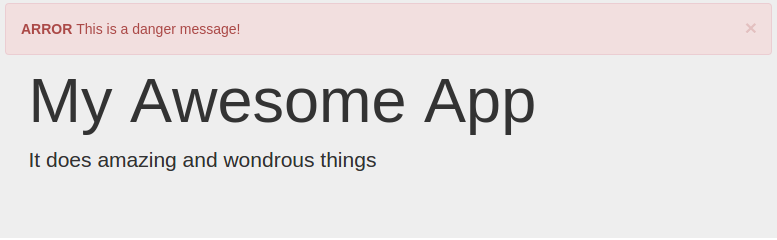

# React Bootstrap Notifier

> A react component to show growl-like notifications using bootstrap alerts.



## Install

```
npm install react-spinner --save
```

## Usage

```js
var alerts = [{
	type: "info",
	message: "This is an information message."
}, {
	type: "warning",
	message: "This is a warning message!"
}, {
	type: "danger",
	headline: "Woah!",
	message: "This is a danger message!"
}, {
	type: "success",
	headline: "Good job!",
	message: "This is a success message!"
}];

React.render(<ErrorAlert alerts={alerts} />, document.getElementById("myApp"));
```
